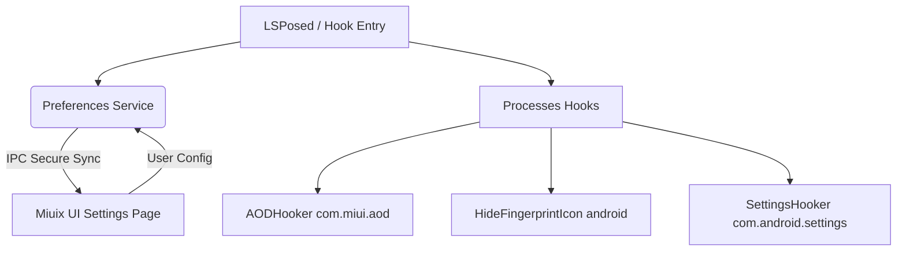

# 🚀 HyperTweak

<div align="center">
  
  
  <p align="center">
    <strong>基于原生 libxposed (API 101) 构建的高性能、模块化 HyperOS 锁屏与系统定制优化框架</strong>
  </p>

  <p align="center">
    <a href="https://github.com/TakeKazeX/HyperTweak/actions"></a>
    <a href="https://kotlinlang.org"></a>
    <a href="https://developer.android.com"></a>
    <a href="LICENSE"></a>
  </p>
</div>

---

## 📖 简介

**HyperTweak** 是一款专为小米澎湃 OS (HyperOS) 及 MIUI 系统深度定制的 Xposed 模块。本项目完全采用现代 Android 开发技术栈，抛弃传统 YukiHookAPI 框架，直接基于原生的 **libxposed (API 101)** 构建，为您带来极佳的运行性能、超低的内存占用与卓越的模块稳定性。

主界面使用现代化 **Miuix UI** Compose 架构编写，提供与 HyperOS 高度契合的系统级视觉质感与平滑交互体验。

---

## ✨ 核心特性

| 功能模块 | 描述 | 实现原理与技术细节 |
| :--- | :--- | :--- |
| **🖼️ 全屏息屏显示 (AOD)** | 动态解除 MIUI/HyperOS 系统限制，让普通息屏样式完美支持全屏壁纸显示。 | 自动向 `com.miui.aod` 及系统设置注入拦截逻辑，激活原生 AOD 专属配置菜单。 |
| **🔘 智能隐藏锁屏指纹** | 在锁屏切换或唤醒过渡时，完美隐藏屏幕下指纹图标/光圈，保持桌面纯净。 | 采用双层拦截机制（Drawable 替换 + 悬浮 View 透明度重置为 `0f`），同时保留完整解锁功能与触摸响应。 |
| **🌍 谷歌服务 (GMS) 解锁** | 绕过国内版固件对谷歌移动服务的安装与运行限制，开启完整 Play 生态。 | 动态勾挂相关系统服务，直接放行 GMS 安装许可校验。 |
| **⚙️ 原生系统设置项注入** | 在系统「设置」中注入模块入口，与系统风格浑然一体。 | 模块入口（带澎湃风格板手图标）无感插入在「设置」的 Wi-Fi 列表下方，方便快速配置。 |
| **🙈 桌面图标动态隐藏** | 支持将模块图标从主屏幕隐藏，防止桌面杂乱。 | 隐藏后可通过 LSPosed 管理器或系统设置内的注入入口随时唤起模块主界面。 |

---

## 🛠️ 架构设计

HyperTweak 采用高度解耦的模块化架构设计，各模块基于 LSPosed 提供的进程间通信 (IPC) 机制进行高效数据交换，避免频繁读取配置导致卡顿：



* **`HookEntry`**: 模块的主入口，生命周期受 `libxposed` 托管，按需加载。
* **`Preferences`**: 基于 `libxposed` 内置的 Binder 共享服务机制，保障跨进程配置读取的安全、稳定与低时延。
* **`rules/`**: 功能独立成类（如 `AODHooker`、`HideFingerprintIcon`），单责原则，极易维护与扩展。

---

## 🚀 编译与部署

### 开发环境要求
- **IDE**: Android Studio Ladybug (2024.2.1) 或更高版本
- **Build Tool**: Gradle 9.5.1
- **Target SDK**: Android 16 (API 37)
- **Min SDK**: Android 15 (API 35)

### 本地编译
在项目根目录下，执行以下命令构建 Release 版本：
```bash
./gradlew assembleRelease
```
编译成功后，脚本会自动读取您的 Git 提交数作为编译的 `versionCode`，生成的安装包将存放于：
```
app/build/outputs/apk/release/HyperTweak-v1.2.1-release.apk
```

---

## 🤝 致谢

* **[libxposed](https://github.com/LSPosed/libxposed)** - 现代化轻量级 Xposed 开发接口标准。
* **[KavaRef](https://github.com/TakeKazeX/KavaRef)** - 精美、高效的 Kotlin 强类型反射封装。
* **[Miuix UI](https://github.com/Yukonga/miuix)** - 精美的 HyperOS/MIUI 风格 Compose 组件库。
* **[HyperOShape](https://github.com)** - 提供指纹样式去除思路参考。
* **[XiaomiHelper](https://github.com) / [HyperCeiler](https://github.com)** - 提供系统设置项注入实现参考。

---

## 📄 许可证

本项目基于 [MIT License](LICENSE) 许可协议开源。
